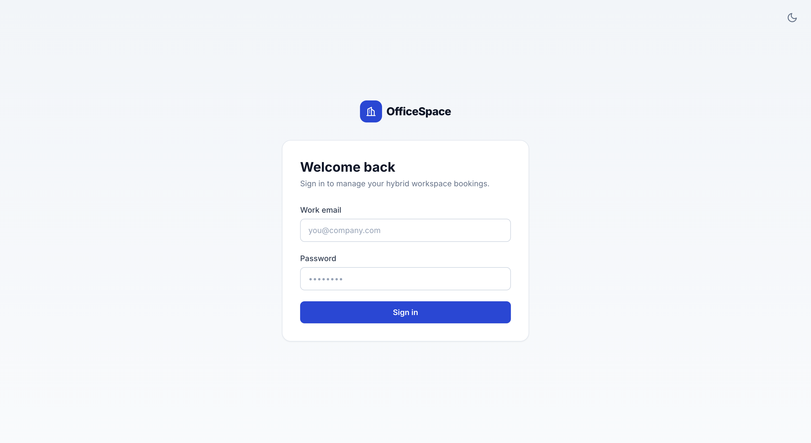
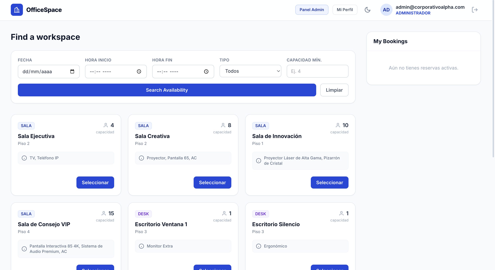
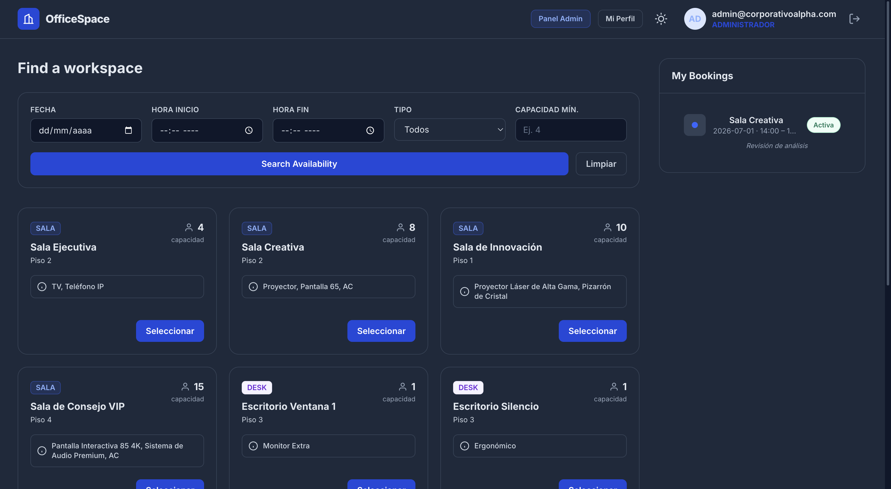
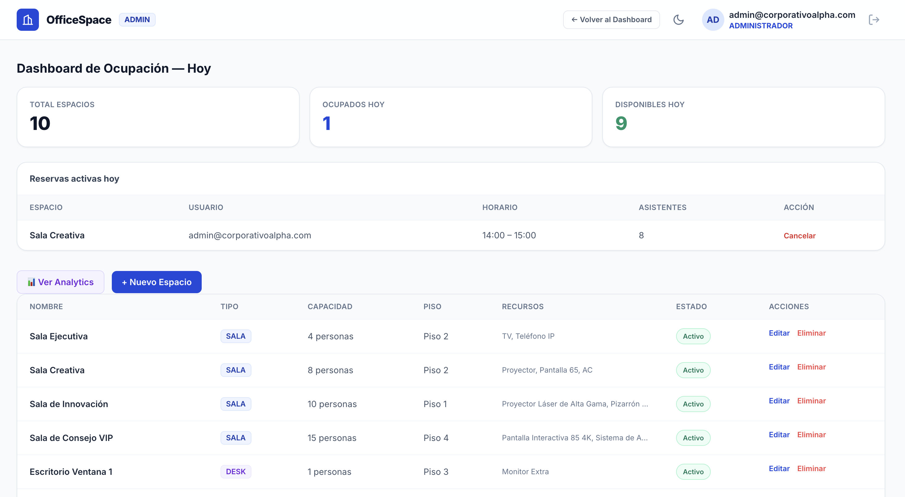
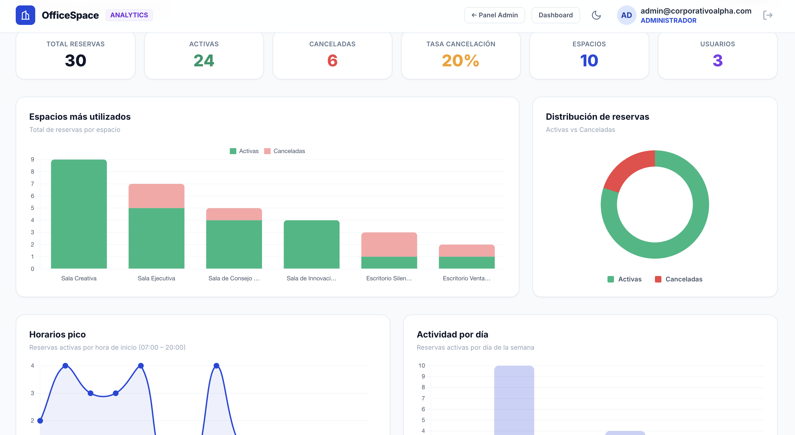
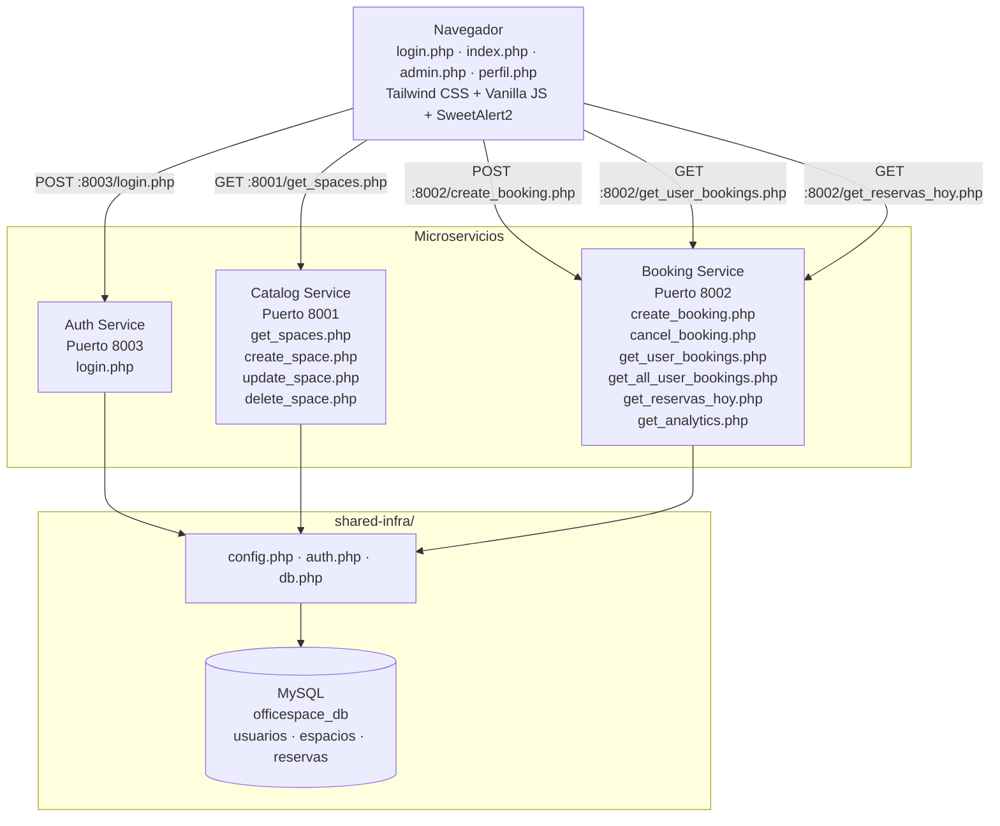

# OfficeSpace — Gestión Híbrida Inteligente

Sistema de reserva de espacios de trabajo desarrollado para el Hackathon IBM 2026. Permite a los colaboradores buscar y reservar salas de juntas y escritorios, e incluye un panel de administración para la gestión del catálogo de espacios y el análisis de ocupación.

La aplicación está construida sobre una arquitectura de microservicios en PHP 8.3, con MySQL como almacén de datos y autenticación mediante JSON Web Tokens firmados.

---

## Vista General

<!--
  Coloca tus imágenes en la carpeta screenshots/ con EXACTAMENTE estos nombres
  para que se muestren aquí automáticamente (formato .png):
    login.png · dashboard.png · dark-mode.png · admin.png · analytics.png
-->

**Inicio de sesión**



**Dashboard de reservas**



**Modo oscuro**



**Panel de administración**



**Analítica de ocupación**



---

## Tabla de Contenidos

- [Requisitos Previos](#requisitos-previos)
- [Configuración de Entorno](#configuración-de-entorno)
- [Instalación y Arranque](#instalación-y-arranque)
- [Apagado del Sistema](#apagado-del-sistema)
- [Credenciales de Prueba](#credenciales-de-prueba)
- [Arquitectura del Sistema](#arquitectura-del-sistema)
- [Seguridad](#seguridad)
- [Decisiones Técnicas](#decisiones-técnicas)
- [Documentación de API](#documentación-de-api)
- [Guía de Usuario](#guía-de-usuario)
- [Estructura del Proyecto](#estructura-del-proyecto)

---

## Requisitos Previos

El proyecto se ejecuta íntegramente en contenedores; no necesitas instalar PHP ni MySQL en tu equipo.

| Herramienta | Versión | Notas |
|---|---|---|
| Docker | 24.x+ | Docker Desktop en macOS/Windows |
| Docker Compose | v2+ | Incluido en Docker Desktop |
| Navegador | Cualquier moderno | Chrome recomendado |

---

## Configuración de Entorno

Los secretos y parámetros de conexión se gestionan mediante variables de entorno y **no se incluyen en el control de versiones**. Antes del primer arranque, crea tu archivo de configuración local a partir de la plantilla:

```bash
cp .env.example .env
```

A continuación, edita `.env` y define al menos los siguientes valores:

| Variable | Descripción |
|---|---|
| `DB_HOST`, `DB_PORT`, `DB_USER`, `DB_PASS`, `DB_NAME` | Parámetros de conexión a MySQL |
| `JWT_SECRET` | Secreto para firmar los tokens. **Obligatorio.** Genera uno robusto, por ejemplo con `openssl rand -hex 32` |
| `JWT_TTL` | Vigencia del token en segundos (por defecto 86400 = 24 h) |
| `CORS_ORIGINS` | Lista de orígenes permitidos para CORS, separados por comas |

El archivo `.env` está excluido en `.gitignore`. Nunca lo subas al repositorio.

---

## Instalación y Arranque

Toda la arquitectura —microservicios, base de datos y frontend— se levanta contenerizada con un único comando.

1. Clona el repositorio y entra en la carpeta:

   ```bash
   git clone https://github.com/tu-usuario/officespace-ibm.git
   cd officespace-ibm
   ```

2. Crea tu archivo `.env` (ver [Configuración de Entorno](#configuración-de-entorno)).

3. Construye y levanta los servicios en segundo plano:

   ```bash
   docker-compose up -d --build
   ```

   El comando descarga las imágenes necesarias, compila los microservicios instalando los drivers nativos de MySQL y, en el primer arranque, ejecuta `shared-infra/init-db.sql` para crear y poblar la base de datos.

4. Verifica que los contenedores estén en ejecución:

   ```bash
   docker ps
   ```

5. Accede a la aplicación:

   - Aplicación (frontend): http://localhost:8080/login.php
   - Documentación de API: http://localhost:8080/api-docs.php

   Comprobación rápida del backend: `http://localhost:8001/get_spaces.php` debe devolver un JSON con los espacios registrados.

---

## Apagado del Sistema

### Docker

Detener y eliminar los contenedores conservando la base de datos:

```bash
docker-compose down
```

Este comando preserva el volumen `mysql_data`, por lo que tus reservas y espacios siguen disponibles en el siguiente arranque.

Para detener **y borrar también la base de datos** (vuelve al estado inicial con los datos de `init-db.sql`):

```bash
docker-compose down -v
```

Si solo quieres pausar sin eliminar los contenedores:

```bash
docker-compose stop
```

Después de apagar, puedes cerrar Docker Desktop con normalidad.

---

## Credenciales de Prueba

Las contraseñas se almacenan como hash bcrypt. Las credenciales de demostración son:

| Rol | Email | Contraseña |
|---|---|---|
| Administrador | admin@corporativoalpha.com | Admin123 |
| Colaborador | carlos.mendez@corporativoalpha.com | User123 |
| Colaborador | ana.torres@corporativoalpha.com | User123 |

---

## Arquitectura del Sistema



El módulo `shared-infra` centraliza la configuración (`config.php`), el middleware de autenticación y CORS (`auth.php`) y la conexión a la base de datos (`db.php`), evitando la duplicación de lógica entre servicios.

### Puertos del sistema

| Servicio | Puerto (Docker) | Descripción |
|---|---|---|
| Frontend | 8080 | Sirve los archivos PHP del frontend |
| Auth Service | 8003 | Autenticación y emisión de JWT |
| Catalog Service | 8001 | Gestión del catálogo de espacios |
| Booking Service | 8002 | Motor de reservas, validaciones y analítica |
| MySQL | 3307 → 3306 | Base de datos compartida |

El frontend se publica en el puerto 8080 del host y MySQL se expone en el 3307 (mapeado al 3306 interno del contenedor).

### Esquema de Base de Datos

```
usuarios
├── id_usuario (PK, AUTO_INCREMENT)
├── email (UNIQUE)
├── password (hash bcrypt)
├── rol (ENUM: ADMINISTRADOR, COLABORADOR)
└── activo (TINYINT)

espacios
├── id_espacio (PK, AUTO_INCREMENT)
├── nombre
├── tipo (ENUM: SALA, DESK)
├── capacidad
├── recursos
├── piso
└── activo (TINYINT)

reservas
├── id_reserva (PK, AUTO_INCREMENT)
├── id_espacio (FK → espacios)
├── id_usuario (FK → usuarios)
├── fecha (DATE)
├── hora_inicio (TIME)
├── hora_fin (TIME)
├── asistentes
├── notas (TEXT, nullable)
├── estatus (ENUM: Activa, Cancelada)
└── fecha_creacion (TIMESTAMP)
```

---

## Seguridad

El sistema aplica las siguientes medidas:

- **Autenticación por JWT firmado.** Los tokens se firman con HMAC-SHA256 y un secreto de entorno. Cada servicio protegido **verifica la firma** y la expiración (`exp`) antes de confiar en el contenido del token, mediante una comparación en tiempo constante (`hash_equals`). Un token manipulado es rechazado.
- **Control de acceso por roles (RBAC).** Los endpoints administrativos exigen el rol `ADMINISTRADOR`; la cancelación de reservas valida la propiedad del recurso o el rol de administrador.
- **Sentencias preparadas.** Todas las consultas que reciben datos del cliente usan parámetros vinculados, eliminando el riesgo de inyección SQL.
- **Contraseñas con hash.** Se almacenan con `password_hash` (bcrypt) y se verifican con `password_verify`, con re-hash automático cuando cambia el algoritmo o el coste.
- **Secretos fuera del código.** Credenciales y secreto JWT se leen de variables de entorno (`.env`), excluido del repositorio.
- **CORS restringido.** Las cabeceras de origen cruzado se limitan a una allowlist configurable en lugar de aceptar cualquier origen.
- **Transacciones en operaciones críticas.** La creación de reservas se ejecuta dentro de una transacción con bloqueo de fila (`SELECT ... FOR UPDATE`), evitando la doble reserva por condiciones de carrera.

---

## Decisiones Técnicas

### Microservicios con base de datos compartida

Se adoptó una arquitectura híbrida de microservicios con base de datos compartida por las siguientes razones:

1. **Separación de responsabilidades.** Cada servicio tiene un dominio bien definido —autenticación, catálogo y reservas— y se comunica con los demás únicamente a través de HTTP.

2. **Velocidad de desarrollo.** Una base de datos compartida elimina la complejidad de la sincronización entre bases distribuidas (event sourcing, sagas), permitiendo concentrar el esfuerzo en la lógica de negocio.

3. **Despliegue independiente.** Cada servicio tiene su propio proceso y puerto, lo que permite reiniciarlo o modificarlo sin afectar a los demás.

4. **Transacciones simples.** Al compartir la base, validaciones críticas como el control de solapamiento de horarios se resuelven con una sola transacción SQL, sin coordinación distribuida.

### Elección de PHP

PHP 8.3 es el lenguaje con el que el equipo tiene mayor experiencia, ofrece mejoras notables de rendimiento y tipado, e integra de forma directa con las imágenes oficiales de Docker, reduciendo el tiempo de puesta en marcha.

### Algoritmo de no-solapamiento

La validación de conflictos de horario aplica la regla de intersección de intervalos:

```
Una nueva reserva choca si:
  hora_inicio_nueva < hora_fin_existente
  AND
  hora_fin_nueva > hora_inicio_existente
```

Esta condición cubre todos los casos: solapamiento parcial por la izquierda, parcial por la derecha, contenido y envolvente. La comprobación se ejecuta dentro de la transacción de creación para garantizar consistencia bajo concurrencia.

### Implementación del JWT

Por requisito del hackathon, el JWT se implementa sin librerías externas, con HMAC-SHA256:

```
token = base64url(header) + "." + base64url(payload) + "." + base64url(firma)
firma = HMAC-SHA256(header + "." + payload, JWT_SECRET)
```

El payload incluye `id_usuario`, `email`, `rol`, `iat` y `exp`. La emisión y la verificación residen en `shared-infra/auth.php` y son reutilizadas por todos los servicios.

---

## Documentación de API

La documentación interactiva está disponible en `http://localhost:8080/api-docs.php`.

### Auth Service — Puerto 8003

#### POST /login.php

Autentica un usuario y devuelve un token JWT.

```bash
curl -X POST http://localhost:8003/login.php \
  -H "Content-Type: application/json" \
  -d '{
    "email": "carlos.mendez@corporativoalpha.com",
    "password": "User123"
  }'
```

Respuesta exitosa (200):

```json
{
  "status": "success",
  "token": "eyJ0eXAiOiJKV1QiLCJhbGciOiJIUzI1NiJ9...",
  "user": {
    "id": 2,
    "email": "carlos.mendez@corporativoalpha.com",
    "rol": "COLABORADOR"
  }
}
```

Respuesta fallida (401):

```json
{ "status": "error", "message": "Credenciales incorrectas" }
```

---

### Catalog Service — Puerto 8001

#### GET /get_spaces.php

Obtiene los espacios disponibles con filtros opcionales.

```bash
# Todos los espacios activos
curl http://localhost:8001/get_spaces.php

# Filtrado por fecha, horario, tipo y capacidad
curl "http://localhost:8001/get_spaces.php?fecha=2026-06-25&hora_inicio=09:00&hora_fin=11:00&tipo=SALA&capacidad=4"

# Incluir inactivos (requiere token de administrador)
curl "http://localhost:8001/get_spaces.php?mostrar_inactivos=1" \
  -H "Authorization: Bearer <TOKEN_ADMIN>"
```

| Parámetro | Tipo | Descripción |
|---|---|---|
| fecha | string (Y-m-d) | Fecha de la reserva |
| hora_inicio | string (H:i) | Hora de inicio |
| hora_fin | string (H:i) | Hora de fin |
| tipo | SALA \| DESK | Tipo de espacio |
| capacidad | integer | Capacidad mínima requerida |
| mostrar_inactivos | 0 \| 1 | Solo administrador |

#### POST /create_space.php — Administrador

```bash
curl -X POST http://localhost:8001/create_space.php \
  -H "Content-Type: application/json" \
  -H "Authorization: Bearer <TOKEN_ADMIN>" \
  -d '{
    "nombre": "Sala Nueva",
    "tipo": "SALA",
    "capacidad": 10,
    "piso": "Piso 3",
    "recursos": "Proyector, AC"
  }'
```

#### POST /update_space.php — Administrador

```bash
curl -X POST http://localhost:8001/update_space.php \
  -H "Content-Type: application/json" \
  -H "Authorization: Bearer <TOKEN_ADMIN>" \
  -d '{
    "id_espacio": 1,
    "nombre": "Sala Creativa Plus",
    "tipo": "SALA",
    "capacidad": 10,
    "piso": "Piso 2",
    "recursos": "Proyector, AC",
    "activo": 1
  }'
```

#### POST /delete_space.php — Administrador

```bash
curl -X POST http://localhost:8001/delete_space.php \
  -H "Content-Type: application/json" \
  -H "Authorization: Bearer <TOKEN_ADMIN>" \
  -d '{ "id_espacio": 1 }'
```

---

### Booking Service — Puerto 8002

#### POST /create_booking.php — Autenticado

Crea una reserva aplicando todas las validaciones de negocio. El propietario de la reserva se toma del token, no del cuerpo de la petición.

```bash
curl -X POST http://localhost:8002/create_booking.php \
  -H "Content-Type: application/json" \
  -H "Authorization: Bearer <TOKEN>" \
  -d '{
    "id_espacio": 1,
    "fecha": "2026-06-25",
    "hora_inicio": "09:00",
    "hora_fin": "11:00",
    "asistentes": 5,
    "notas": "Revisión de avances Q2"
  }'
```

Respuestas posibles:

| Código | Situación |
|---|---|
| 201 | Reserva creada exitosamente |
| 400 | Fecha pasada, hora pasada, fuera de horario de oficina o capacidad excedida |
| 401 | Token ausente, inválido o expirado |
| 404 | El espacio no existe o no está disponible |
| 409 | Solapamiento de horario con una reserva existente |
| 500 | Error interno del servidor |

#### GET /get_user_bookings.php — Autenticado

Reservas activas y futuras del usuario autenticado.

```bash
curl http://localhost:8002/get_user_bookings.php \
  -H "Authorization: Bearer <TOKEN>"
```

#### GET /get_all_user_bookings.php — Autenticado

Historial completo de reservas (activas y canceladas) para la pantalla de perfil.

```bash
curl http://localhost:8002/get_all_user_bookings.php \
  -H "Authorization: Bearer <TOKEN>"
```

#### POST /cancel_booking.php — Autenticado

Cancela una reserva futura. Solo el propietario o un administrador puede cancelarla.

```bash
curl -X POST http://localhost:8002/cancel_booking.php \
  -H "Content-Type: application/json" \
  -H "Authorization: Bearer <TOKEN>" \
  -d '{ "id_reserva": 5 }'
```

#### GET /get_reservas_hoy.php — Administrador

Reservas activas del día actual para el dashboard de ocupación.

```bash
curl http://localhost:8002/get_reservas_hoy.php \
  -H "Authorization: Bearer <TOKEN_ADMIN>"
```

#### GET /get_analytics.php — Administrador

Métricas de ocupación: espacios más usados, horarios pico, tasa de cancelación y distribución por día de la semana.

```bash
curl http://localhost:8002/get_analytics.php \
  -H "Authorization: Bearer <TOKEN_ADMIN>"
```

---

### Códigos de estado comunes

| Código HTTP | Significado |
|---|---|
| 200 | OK — operación exitosa |
| 201 | Created — recurso creado |
| 400 | Bad Request — datos inválidos o regla de negocio violada |
| 401 | Unauthorized — token ausente, inválido o expirado |
| 403 | Forbidden — rol sin permisos suficientes |
| 404 | Not Found — recurso no encontrado |
| 409 | Conflict — solapamiento de horario |
| 500 | Internal Server Error |

---

## Guía de Usuario

### Inicio de sesión

1. Abre la página de login.
2. Ingresa tu email corporativo y contraseña.
3. El sistema redirige según el rol:
   - Administrador: dashboard con acceso al panel de administración.
   - Colaborador: dashboard de búsqueda de espacios.

Si las credenciales son incorrectas, se muestra un mensaje de error en pantalla.

### Búsqueda y reserva de espacios

1. **Buscar disponibilidad.** Selecciona fecha, hora de inicio y hora de fin; opcionalmente filtra por tipo y capacidad mínima, y ejecuta la búsqueda. Solo aparecen los espacios libres para ese horario.
2. **Reservar.** Selecciona el espacio deseado, confirma fecha y horario, indica el número de asistentes y, opcionalmente, una nota. Confirma la reserva.
3. **Consultar reservas.** En la barra lateral aparecen tus reservas activas; desde "Mi Perfil" puedes ver el historial completo.

Reglas del sistema:

- Las reservas solo se permiten en horario de oficina (07:00 – 21:00).
- No se permiten reservas en fechas u horas pasadas.
- No se puede reservar un espacio ya ocupado en ese horario.
- No se puede exceder la capacidad del espacio.

### Administración de espacios (rol Administrador)

Desde el panel de administración:

- **Dashboard de ocupación.** Muestra espacios ocupados frente a disponibles y la lista de reservas activas del día, con opción de cancelarlas.
- **Gestión del catálogo.** Crear, editar, desactivar y eliminar espacios. La eliminación solo procede si el espacio no tiene reservas activas futuras; en caso contrario, conviene desactivarlo.
- **Analítica.** Visualización de métricas de uso derivadas de los datos reales del sistema.

---

## Estructura del Proyecto

```
officespace-ibm/
├── auth-service/
│   ├── Dockerfile
│   └── login.php
├── booking-service/
│   ├── Dockerfile
│   ├── create_booking.php
│   ├── cancel_booking.php
│   ├── get_user_bookings.php
│   ├── get_all_user_bookings.php
│   ├── get_reservas_hoy.php
│   └── get_analytics.php
├── catalog-service/
│   ├── Dockerfile
│   ├── get_spaces.php
│   ├── create_space.php
│   ├── update_space.php
│   └── delete_space.php
├── frontend/
│   ├── login.php
│   ├── index.php
│   ├── admin.php
│   ├── analytics.php
│   ├── perfil.php
│   ├── api-docs.php        # Swagger UI (documentación interactiva)
│   ├── openapi.yaml        # contrato OpenAPI 3
│   ├── theme.css           # estilos del modo oscuro
│   ├── theme.js            # interruptor de tema (persistente y sincronizado entre pestañas)
│   └── session.js          # cierra sesión automáticamente ante un token inválido (401)
├── shared-infra/
│   ├── config.php          # configuración y carga de variables de entorno
│   ├── auth.php            # middleware: CORS + emisión/verificación de JWT
│   ├── db.php
│   └── init-db.sql
├── .env.example
├── .gitignore
├── docker-compose.yml
└── README.md
```

---

## Equipo

Desarrollado para el Hackathon IBM 2026 — escenario OfficeSpace: Gestión Híbrida Inteligente.

Stack: PHP 8.3 · MySQL · Docker · HTML5 · Tailwind CSS · Vanilla JS · SweetAlert2
